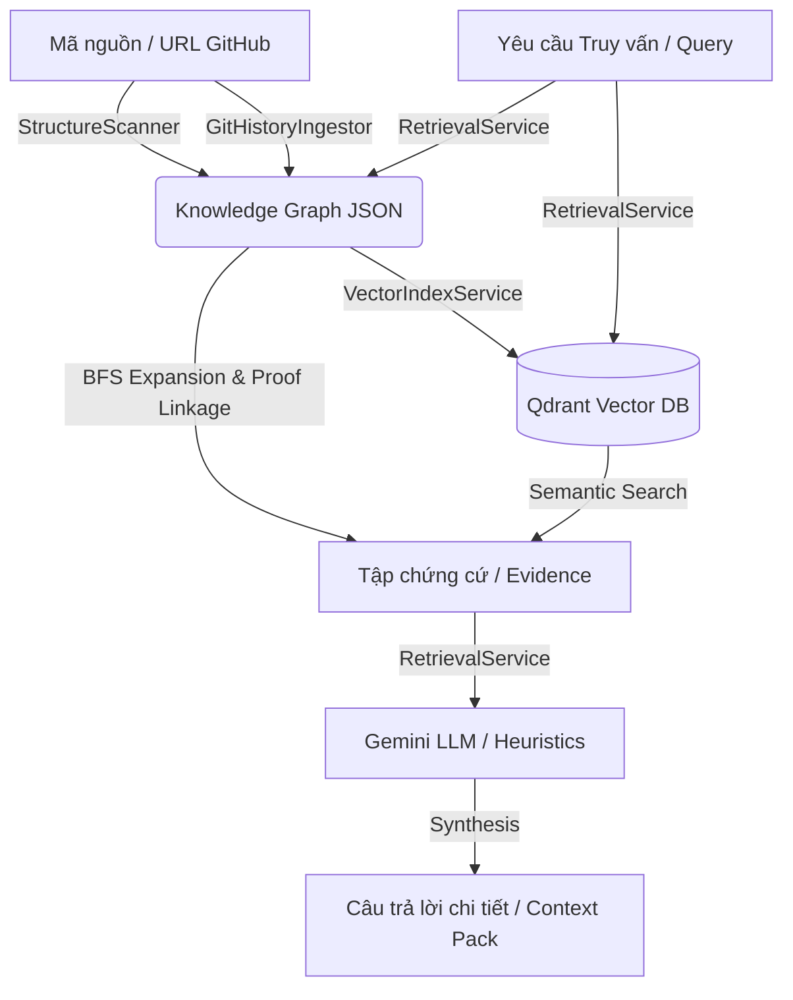

# DevOnboard Backend: Hướng dẫn Chi tiết Cấu trúc, Cơ chế Hàm & Phối hợp

Tài liệu này tổng hợp chi tiết ý nghĩa của từng file, cơ chế xử lý của từng hàm/phương thức bên trong và luồng phối hợp hoạt động của hệ thống `backend/`.

---

## 1. Sơ đồ Tổng quan Hệ thống (System Architecture)

Hệ thống backend được xây dựng trên nền tảng **FastAPI**, lưu trữ Đồ thị Tri thức dưới dạng JSON tĩnh (authoritative), tăng tốc tìm kiếm ngữ nghĩa bằng **Qdrant Vector Database**, và xử lý lập luận tự động thông qua **Gemini API**.



---

## 2. Chi tiết Ý nghĩa & Cơ chế Xử lý của Từng Hàm trong Từng File

### 2.1. Cấu hình & Khởi chạy

#### 📂 `backend/app/config.py`
Quản lý nạp cấu hình và biến môi trường thông qua `Pydantic Settings`.
*   **`get_settings() -> Settings`**:
    *   *Cơ chế:* Sử dụng bộ trang trí `@lru_cache` để biến hàm thành một thực thể Singleton. Đảm bảo cấu hình từ file `.env` chỉ được nạp và phân tích cú pháp đúng một lần duy nhất trong suốt vòng đời ứng dụng.

#### 📂 `backend/app/main.py`
Khởi tạo ứng dụng FastAPI và quản lý vòng đời bộ nhớ đệm đồ thị.
*   **`get_cached_graph()`, `set_cached_graph(graph)`, `invalidate_graph_cache()`**:
    *   *Cơ chế:* Đọc, ghi hoặc xóa biến toàn cục `_graph_cache` chứa đồ thị trong RAM. Tránh việc liên tục đọc đĩa file JSON lớn giữa các yêu cầu truy vấn liên tiếp.
*   **`/health` (GET)**:
    *   *Cơ chế:* Kiểm tra tính khả dụng của file đồ thị cục bộ, đồng bộ hóa chỉ mục vector trong Qdrant bằng cách kiểm tra kết nối mạng và tính hợp lệ của khóa API Gemini. Trả về trạng thái chi tiết của hệ thống.

---

### 2.2. Đồ thị Tri thức (`app/graph/`)

#### 📂 `backend/app/graph/ids.py`
Hàm tiện ích sinh ID thống nhất, loại bỏ trùng lặp và không nhất quán khóa.
*   **`normalize_repo_path(path: str) -> str`**:
    *   *Cơ chế:* Thay thế tất cả ký tự gạch chéo ngược `\` thành gạch chéo xuôi `/`, sau đó chuyển thành chuỗi thông qua `PurePosixPath` để đồng bộ đường dẫn trên cả Linux và Windows.
*   **`slugify(value: str) -> str`**:
    *   *Cơ chế:* Sử dụng Regex thay thế toàn bộ ký tự không phải chữ và số (`[^a-zA-Z0-9]+`) thành dấu gạch ngang `-`, viết thường chuỗi và loại bỏ gạch ngang ở đầu/cuối. Nếu rỗng, mặc định trả về `"unnamed"`.
*   **`file_id(path)`, `function_id(path, name)`, `module_id(path)`, `source_commit_id(sha)`, `source_pr_id(num)`, `claim_id(name)`, `entity_id(kind, val)`, `edge_id(src, tgt, type)`**:
    *   *Cơ chế:* Ghép chuỗi tiền tố tương ứng với loại thực thể (ví dụ: `file:{normalize_repo_path(path)}` hoặc `edge:{edge_type}:{source}->{target}`) để đảm bảo mỗi thực thể/cạnh có một khóa duy nhất trên toàn bộ đồ thị.

#### 📂 `backend/app/graph/models.py`
Định nghĩa các schemas dữ liệu Pydantic.
*   **`KnowledgeGraph.node_by_id(node_id: str) -> GraphNode`**:
    *   *Cơ chế:* Quét tuyến tính qua danh sách `nodes`. Nếu trùng ID thì trả về nút đó, ngược lại quăng lỗi `KeyError`.

#### 📂 `backend/app/graph/graph_store.py`
Đọc/ghi và thao tác cập nhật đồ thị.
*   **`load(path: Path) -> GraphStore`**:
    *   *Cơ chế:* Đọc nội dung tệp JSON, gọi `KnowledgeGraph.model_validate()` để giải tuần tự hóa (deserialize) và xác thực kiểu dữ liệu, sau đó khởi tạo đối tượng `GraphStore`.
*   **`save()`**:
    *   *Cơ chế:* Sắp xếp danh sách `nodes` và `edges` theo thứ tự ID tăng dần (để file JSON ghi ra luôn đồng nhất về thứ tự dòng, hỗ trợ so sánh Git diff tốt hơn), cập nhật thuộc tính `generated_at` sang UTC hiện tại, thụt dòng định dạng 2 dấu cách và ghi đè lên đĩa.
*   **`upsert_node(node: GraphNode) -> GraphNode`**:
    *   *Cơ chế:* Kiểm tra ID nút trong bảng băm cục bộ `_nodes_by_id`. Nếu đã tồn tại, tiến hành ghi đè các thuộc tính mới (`name`, `summary`, `file_path`, `line_range`), gộp danh sách thẻ `tags` bằng phép hợp tập hợp (`union`), cập nhật từ điển `metadata` bằng cách đè đè giá trị mới lên cũ, và trả về nút cũ đã sửa. Nếu chưa có, chèn nút mới vào danh sách.
*   **`upsert_edge(edge: GraphEdge) -> GraphEdge`**:
    *   *Cơ chế:* Kiểm tra ID cạnh trong `_edges_by_id`. Nếu tồn tại, cập nhật `summary` và `metadata`, đặt trọng số `weight` bằng giá trị cực đại giữa cũ và mới (`max(existing.weight, edge.weight)`), ngược lại chèn mới.
*   **`merge(other: KnowledgeGraph) -> KnowledgeGraph`**:
    *   *Cơ chế:* Duyệt qua tất cả các nút và cạnh trong đồ thị `other`, chạy `upsert_node` và `upsert_edge` tương ứng để gộp dữ liệu hai đồ thị, sau đó sắp xếp lại danh sách.

---

### 2.3. Phân tích Cấu trúc Mã nguồn (`app/scanner/`)

#### 📂 `backend/app/scanner/structure_scanner.py`
Quét mã nguồn tĩnh để thu thập cấu trúc tệp tin và thực thể mã nguồn.
*   **`scan() -> KnowledgeGraph`**:
    *   *Cơ chế:* Khởi tạo đồ thị mới với siêu dữ liệu repo. Duyệt đệ quy toàn bộ thư mục bằng `rglob("*")`. Với mỗi tệp tin, lọc bỏ nếu nằm trong danh sách bỏ qua, ngược lại gọi `_add_file` để trích xuất thông tin. Nếu Call Graph được kích hoạt, gọi `_add_go_call_graph`.
*   **`_is_excluded(relative_path: str) -> bool`**:
    *   *Cơ chế:* Tách đường dẫn tương đối thành các phần nhỏ, kiểm tra xem đường dẫn hoặc bất kỳ thư mục cha nào có khớp với các mẫu bỏ qua (`exclude_patterns`) bằng hàm khớp mẫu `fnmatch` hay không.
*   **`_add_file(store, path, relative)`**:
    *   *Cơ chế:* Khởi tạo nút loại `file`. Nếu là tệp tài liệu (`.md`, `.txt`, v.v.), đọc nội dung đầu tệp (dưới 2400 ký tự) làm `document_snippet` và đặt nhãn `evidence_type = "doc"`. Gọi `_add_modules` để tạo cấu trúc thư mục cha. Tùy thuộc vào đuôi file (`.go`, `.py`, `.ts`, `.js`), gọi hàm phân tích cú pháp ngôn ngữ tương ứng.
*   **`_add_modules(store, relative, child_id)`**:
    *   *Cơ chế:* Tìm thư mục cha của tệp. Nếu thư mục cha hợp lệ, tạo một nút loại `module` đại diện cho thư mục đó và liên kết một cạnh loại `contains` từ `module -> child` vào đồ thị.
*   **`_add_go_symbols(...)`, `_add_python_symbols(...)`, `_add_tsjs_symbols(...)`**:
    *   *Cơ chế:* Sử dụng biểu thức chính quy (Regex) đặc trưng của từng ngôn ngữ (như `PYTHON_FUNCTION_RE`, `PYTHON_CLASS_RE`, v.v.) quét toàn bộ nội dung tệp tin để tìm dòng khai báo hàm, lớp (class) hoặc kiểu dữ liệu (Go type). Với mỗi thực thể tìm thấy, tính toán số thứ tự dòng bắt đầu, tạo nút thực thể tương ứng (`function`, `class`), chèn vào đồ thị và tạo cạnh `contains` kết nối `file -> symbol`.
*   **`_add_python_import_edges(...)` / `_add_tsjs_import_edges(...)` / `_add_go_import_edges(...)`**:
    *   *Cơ chế:* Quét các dòng khai báo import (như `from x import y`, `import '@/components/z'`). Tính toán đường dẫn của module nguồn để tìm nút tệp tin đích (`target_id`) đã tồn tại hoặc tạo mới nút tệp tin rỗng trong đồ thị, sau đó liên kết cạnh loại `imports` giữa hai file.
*   **`_add_go_call_graph(store, go_files)`**:
    *   *Cơ chế:* Thu thập toàn bộ hàm Go theo tệp tin và gói (package). Quét thân hàm để tìm lời gọi hàm. Xác định hàm mục tiêu thông qua `_resolve_go_callee` và tạo cạnh `calls` kết nối các nút hàm.
*   **`_resolve_go_callee(callee_name, caller_id, same_file, same_package) -> str | None`**:
    *   *Cơ chế:* Tìm kiếm hàm đích trùng tên trong cùng một tệp tin trước. Nếu không có và chế độ quét gói được bật, tìm trong danh sách hàm xuất khẩu của gói đó (loại bỏ các hàm hệ thống/giao tiếp phổ biến nằm trong `NOISY_GO_CALL_NAMES`).

---

### 2.4. Trích xuất Lịch sử & Rationale (`app/ingest/`)

#### 📂 `backend/app/ingest/git_extractor.py`
Trích xuất lịch sử commit cục bộ.
*   **`ingest() -> KnowledgeGraph`**:
    *   *Cơ chế:* Duyệt qua danh sách commit qua `_commit_records`, nạp thông tin commit vào đồ thị. Nếu cấu hình token GitHub, khởi chạy `GitHubFetcher.enrich` để tích hợp PR/Issue. Sau đó chạy `RationaleExtractor` trích xuất quyết định và lưu đồ thị.
*   **`_commit_shas() -> list[str]`**:
    *   *Cơ chế:* Chạy lệnh `git -C <repo_path> rev-list --max-count=<max> HEAD` qua `subprocess` để lấy danh sách mã băm commit SHA.
*   **`_commit_metadata(sha) -> dict`**:
    *   *Cơ chế:* Thực thi `git show -s --format=%an%x1f%ae%x1f%aI%x1f%s%x1f%b <sha>` sử dụng ký tự phân tách đặc biệt `\x1f` để bóc tách thông tin tác giả, email, ngày giờ, tiêu đề commit và phần thân commit một cách deterministics.
*   **`_files_touched(sha) -> list[str]`**:
    *   *Cơ chế:* Thực thi lệnh `git show --name-only --pretty=format: <sha>` để lấy danh sách các tệp tin bị sửa đổi trong commit.
*   **`_ingest_commit_record(record)`**:
    *   *Cơ chế:* Tạo nút `source` (kiểu `commit`). Tạo nút tác giả `entity` (tác giả commit) liên kết qua cạnh `authored_by`. Với mỗi tệp tin bị sửa đổi trong commit đó, tạo cạnh `commit -> file` loại `documents`. Nếu nút file chưa có trong đồ thị (ví dụ: file đã bị xóa trong nhánh hiện tại nhưng tồn tại trong lịch sử), khởi tạo nút tệp tin trống để làm mốc neo lịch sử.

#### 📂 `backend/app/ingest/github_fetcher.py`
Làm giàu dữ liệu lịch sử bằng API GitHub.
*   **`enrich()`**:
    *   *Cơ chế:* Dùng Regex tách tên chủ sở hữu và tên kho từ URL dự án. Gọi API GitHub lấy danh sách PRs (`/pulls?state=all`) và Issues (`/issues?state=all`), sau đó gọi `_create_cross_references` để liên kết chéo.
*   **`_get_paginated(path, max_pages) -> list`**:
    *   *Cơ chế:* Thực hiện truy vấn HTTP GET tuần tự qua thư viện chuẩn `urllib.request` kèm header Authorization chứa token GitHub. Tự động gom trang dữ liệu bằng tham số `page` và `per_page=100` cho tới khi hết trang hoặc đạt giới hạn số trang cấu hình.
*   **`_ingest_pr(owner, repo, pr)`**:
    *   *Cơ chế:* Tạo nút `source` (loại `pr`). Tạo nút tác giả PR liên kết qua cạnh `authored_by`. Tải danh sách file bị thay đổi trong PR (`/pulls/{num}/files`) từ GitHub API và nối cạnh `file -> pr` loại `cites`. Nếu PR chứa mã băm merge commit trùng khớp với nút commit đang có trong đồ thị, tạo cạnh `pr -> commit` loại `builds_on`. Tải và nạp review của PR qua `_ingest_review`.
*   **`_create_cross_references()`**:
    *   *Cơ chế:* Quét tiêu đề và phần thân của tất cả các commit/PR trong đồ thị bằng Regex tìm ký tự `#` đi kèm chữ số (ví dụ: `#12`). Nếu số đó trùng với ID của PR hoặc Issue đang có trong đồ thị, tạo cạnh loại `cites` thể hiện trích dẫn tham chiếu chéo giữa hai thực thể.

#### 📂 `backend/app/ingest/rationale_extractor.py`
Tự động phát hiện các quyết định thiết kế từ lịch sử.
*   **`extract() -> KnowledgeGraph`**:
    *   *Cơ chế:* Duyệt danh sách nút nguồn (Commit/PR). Lấy tóm tắt nội dung, chạy `_extract_claim_text` để lọc lập luận. Nếu phát hiện lập luận hợp lệ, tạo nút `claim` chứa nội dung lập luận đó (đặt độ tin cậy mặc định `0.72`), và liên kết cạnh `source -> claim` loại `exemplifies`.
*   **`_extract_claim_text(text: str) -> str | None`**:
    *   *Cơ chế:* Chuẩn hóa văn bản thành một dòng duy nhất. Duyệt qua 10 mẫu Regex trong `RATIONALE_PATTERNS`. Nếu khớp, trích xuất đoạn văn phía sau từ khóa làm nội dung lập luận, chạy qua `_bound_claim` để tối ưu hóa câu văn, viết hoa chữ cái đầu và kết thúc bằng dấu chấm.
*   **`_bound_claim(claim: str) -> str`**:
    *   *Cơ chế:* Cắt bỏ các chữ ký tự động (như `Co-Authored-By`, `Verification`), trích xuất câu đơn đầu tiên bằng Regex khớp câu, giới hạn độ dài chuỗi tối đa 500 ký tự và loại bỏ các ký tự thừa ở hai đầu.
*   **`_claim_tags(claim_text: str) -> list[str]`**:
    *   *Cơ chế:* Quét chuỗi văn bản lập luận tìm các từ khóa đặc trưng (ví dụ: `risk`, `test`, `performance`, `security`, `rbac`, v.v.) để gán thẻ phân loại tự động cho quyết định thiết kế (ví dụ: thẻ `security`, `performance`, `testability`).

---

### 2.5. Dịch vụ Nghiệp vụ (`app/services/`)

#### 📂 `backend/app/services/repo_resolver.py`
*   **`resolve_repository_input(repo_input, branch, commit, cache_root) -> ResolvedRepository`**:
    *   *Cơ chế:* Kiểm tra xem đầu vào có định dạng URL HTTPS GitHub hay không. Nếu có, bóc tách tên repo, chạy `_sync_github_repo` để clone/update thư mục tương ứng trong bộ nhớ đệm `cache_root`, ngược lại trả về đường dẫn thư mục cục bộ đã được chuẩn hóa.
*   **`_sync_github_repo(path, url, branch, commit) -> str`**:
    *   *Cơ chế:* Nếu thư mục cache chưa tồn tại, thực thi lệnh `git clone --branch <branch> <url> <path>`. Nếu thư mục đã tồn tại, kiểm tra xem nó có sạch (`git status --porcelain` không có file chưa commit), thực hiện `git fetch --prune origin`. Checkout sang nhánh chỉ định, chạy `git pull --ff-only`. Nếu có tham số `commit` SHA, thực hiện checkout sang SHA cụ thể đó. Trả về tên nhánh hiện tại.

#### 📂 `backend/app/services/vector_index.py`
*   **`GeminiEmbedder.embed_texts(texts: list[str]) -> list[list[float]]`**:
    *   *Cơ chế:* Chia nhỏ danh sách văn bản thành các lô nhỏ dựa trên `batch_size`. Sử dụng thư viện `urllib` gọi phương thức POST tới API Google Generative Language `batchEmbedContents`, truyền header khóa API để nhận về danh sách vector số hóa tương ứng.
*   **`VectorIndexService.rebuild(graph: KnowledgeGraph) -> dict`**:
    *   *Cơ chế:* Tải Client kết nối tới Qdrant. Kiểm tra collection tồn tại chưa, nếu chưa thì tạo mới với kích thước cấu hình (768 chiều) và khoảng cách Cosine. Tạo chỉ mục tìm kiếm (Payload Index) trên các trường `graph_node_id`, `node_type`, `repo_name`, `branch`, `file_path`. Lấy tất cả nút đồ thị thuộc kiểu cần vector hóa (`file`, `module`, `source`, `claim`), xây dựng nội dung văn bản cho từng nút qua `_node_text`, gọi nhúng văn bản và chèn (`upsert`) các điểm vector (được định danh UUIDv5 từ ID nút đồ thị) vào Qdrant.
*   **`VectorIndexService.search(query, node_types, limit) -> list[VectorHit]`**:
    *   *Cơ chế:* Sử dụng `GeminiEmbedder` nhúng câu hỏi tìm kiếm thành vector. Xây dựng cấu trúc lọc Qdrant (`Filter`) theo danh sách `node_types` truyền vào. Truy vấn Qdrant thu về các điểm vector khớp nhất, ánh xạ ID vector và payload tương ứng thành danh sách `VectorHit`.

#### 📂 `backend/app/services/retrieval.py`
Trái tim RAG (Retrieval-Augmented Generation) của hệ thống.
*   **`answer(...) -> QueryResult`**:
    *   *Cơ chế:* Thực thi luồng xử lý RAG nâng cao theo các bước tuần tự:
        1.  Phân loại tuyến xử lý bằng `_route` để chọn một trong các chế độ: `structural`, `historical`, hoặc `hybrid`.
        2.  Tìm kiếm các nút tương đồng ngữ nghĩa từ Vector DB bằng `_vector_hits`.
        3.  Tìm các nút hạt giống cấu trúc (`seed_nodes`) thông qua từ khóa câu hỏi (`_structural_seed_matches`) kết hợp danh sách nút được chỉ định trực tiếp (`node_ids`).
        4.  Quét loang đồ thị tìm cấu trúc lân cận bằng `_bfs_expand` (duyệt đệ quy qua hàng đợi các cạnh liên kết cấu trúc của GoClaw với độ sâu tối đa là 2).
        5.  Lần theo các cạnh quan hệ lịch sử (`cites`, `documents`, `exemplifies`) để kéo thêm các nút lịch sử liên quan (commit, PR, claim) bằng phương thức `_historical_matches`.
        6.  Xếp hạng và lọc bớt chứng cứ bằng `_rank_nodes` áp dụng công thức tính điểm tích hợp.
        7.  Tải nội dung tệp tin thực tế trên đĩa (tối đa 12.000 ký tự đầu tiên) bằng `_get_files_context` để làm ngữ cảnh trực tiếp.
        8.  Nếu khóa LLM tồn tại và không bị giới hạn, gửi prompt yêu cầu tới Gemini tổng hợp phản hồi chi tiết có kèm cú pháp trích dẫn nút đặc biệt (ví dụ: `[node:file:path]`). Ngược lại, kích hoạt `_heuristic_synthesis` tổng hợp tĩnh.
*   **`answer_stream(...)`**:
    *   *Cơ chế:* Luồng xử lý tương tự `answer` nhưng giao tiếp với endpoint `streamGenerateContent` của Gemini. Thực hiện đọc dữ liệu dòng chảy (chunk-by-chunk) trả về từ luồng kết nối HTTP thông qua vòng lặp, bóc tách NDJSON và liên tục sinh (`yield`) dữ liệu sự kiện Token về cho router xử lý Server-Sent Events (SSE).
*   **`_route(query, mode) -> Route`**:
    *   *Cơ chế:* Trả về chế độ chỉ định trực tiếp nếu được yêu cầu. Ngược lại, lọc câu hỏi thành các từ đơn đã được stem (`_stem`), kiểm tra nếu trùng khớp với bộ từ khóa lai (như `refactor`, `blast radius`, `risk`) thì định tuyến `hybrid`. Nếu trùng khớp từ khóa lịch sử (như `why`, `pr`, `commit`, `rationale`) thì định tuyến `historical`, ngược lại mặc định là `structural`.
*   **`_score_node(node, terms) -> float`**:
    *   *Cơ chế:* Xây dựng chuỗi văn bản tìm kiếm của nút. Tách từ và chạy hàm stem tiếng Anh `_stem`. Duyệt danh sách từ khóa tìm kiếm: cộng 1.0 điểm nếu khớp hoàn toàn, cộng 0.5 điểm nếu từ trong nút bắt đầu bằng từ khóa, nhân 2.0 điểm nếu từ khóa khớp với tên nút, nhân 1.5 điểm nếu khớp với ID nút.
*   **`_bfs_expand(seed_nodes) -> list[GraphNode]`**:
    *   *Cơ chế:* Thuật toán Breadth-First Search. Bắt đầu từ danh sách hạt giống cấu trúc, đẩy vào hàng đợi kèm độ sâu `0`. Duyệt hàng đợi: lấy các cạnh ra/vào của nút hiện tại thuộc loại cạnh cấu trúc (`contains`, `calls`, `imports`, `depends_on`, `implements`, `routes`, `contains_flow`, `flow_step`), chèn các nút lân cận chưa duyệt vào danh sách kết quả và hàng đợi với độ sâu tăng thêm 1. Dừng loang khi hàng đợi rỗng, khi đạt độ sâu `2` hoặc số nút vượt quá `30`.
*   **`_historical_matches(structural_nodes, query, vector_hits) -> list[GraphNode]`**:
    *   *Cơ chế:* 
        *   Bước 1: Từ các nút cấu trúc tìm thấy, gọi `_linked_source_ids` lần theo cạnh `cites` và `documents` để tìm các commit/PR tương ứng.
        *   Bước 2: Từ các commit/PR đó, tìm các quyết định thiết kế `claim` liên quan qua cạnh `exemplifies`.
        *   Bước 3: Lọc kết quả qua hàm `_is_direct_historical_evidence` để đảm bảo dữ liệu lịch sử phản ánh đúng câu hỏi (ví dụ: loại bỏ các merge commit nhiễu hoặc các claim có độ dài quá lớn). Lấy thêm các nút lịch sử từ Vector DB và các nút khớp từ khóa làm fallback.
*   **`_rank_nodes(nodes, query, is_structural) -> list[GraphNode]`**:
    *   *Cơ chế:* Chấm điểm và sắp xếp giảm dần các nút theo công thức:
        $$\text{Score} = 0.45 \times \text{graph\_link\_strength} + 0.25 \times \text{semantic\_similarity} + 0.20 \times \text{source\_quality} + 0.10 \times \text{recency} + \text{intent\_boost} - \text{quality\_penalty}$$
        *   `graph_link_strength`: Tỷ lệ nghịch với độ sâu BFS ($1.0 / (depth + 1)$) đối với cấu trúc, hoặc gán trọng số $1.0$/$0.5$/$0.1$ tùy thuộc vào số bước nhảy liên kết lịch sử.
        *   `semantic_similarity`: Điểm cao nhất giữa điểm từ khóa cục bộ và điểm vector Qdrant.
        *   `source_quality`: Đánh giá mức độ đáng tin cậy của thông tin (Ví dụ: claim = 1.0, tài liệu = 0.92, file mã nguồn = 0.8, PR = 0.92, Commit = 0.55).
        *   `recency`: Điểm mới cập nhật (giảm dần từ 1.0 xuống 0.0 theo số ngày trôi qua so với hiện tại).
        *   `intent_boost`: Cộng thêm điểm nếu nút là tài liệu kiến trúc chính (như `AGENTS.md`) và câu hỏi đang hỏi về tổng quan hệ thống.
        *   `quality_penalty`: Trừ điểm rất nặng nếu nút là tệp kiểm thử (test files), tệp hình ảnh tĩnh hoặc tài liệu phụ để đưa chúng xuống cuối danh sách chứng cứ.
*   **`_get_files_context(structural) -> str`**:
    *   *Cơ chế:* Duyệt qua các nút cấu trúc hàng đầu, kiểm tra đường dẫn file cục bộ nằm trong thư mục repo đích (để tránh lỗ hổng bảo mật Path Traversal). Thực hiện đọc nội dung tệp tin thực tế trên đĩa, cắt lấy tối đa 12.000 ký tự đầu tiên để chèn vào ngữ cảnh tổng hợp gửi LLM.

#### 📂 `backend/app/services/evidence_pack.py`
*   **`create(purpose, query, node_ids, changed_files, allow_llm) -> dict`**:
    *   *Cơ chế:* Gom danh sách tệp thay đổi thành hạt giống tìm kiếm. Gọi `RetrievalService.answer` chế độ `hybrid` thu về danh sách chứng cứ cấu trúc và lịch sử. Tách cấu trúc thành phạm vi trực tiếp thay đổi (`changed_scope`) và vùng bị tác động xung quanh (`blast_radius`). Loại bỏ các thực thể nhạy cảm (như khóa bí mật, tệp cấu hình môi trường) qua `_filter_excluded`. Kết hợp dữ liệu lịch sử và sinh tài liệu Markdown thông qua `_markdown` tùy vào mục đích (`pr_review` hoặc `ai_agent_context`).

#### 📂 `backend/app/services/results.py`
*   **`run(repo, target_branch, target_commit) -> dict`**:
    *   *Cơ chế:* Sinh mã ID phiên chạy ngẫu nhiên. Duyệt qua danh sách 5 câu hỏi benchmark tiêu chuẩn, gọi `RetrievalService.answer` để đo lường thời gian truy vấn + tổng hợp LLM. Tự động chấm điểm hiệu quả chứng cứ qua `_evidence_usefulness_score` và ghi tệp kết quả JSON ra đĩa.
*   **`_evidence_usefulness_score(result: QueryResult) -> int`**:
    *   *Cơ chế:* Tính toán điểm từ 1 đến 5 sao theo công thức:
        $$\text{Raw} = 1.0 + 1.0 \times \text{has\_structural} + 1.0 \times \text{has\_historical} + 1.0 \times \text{citation\_coverage} + 0.5 \times \text{diversity} + 0.5 \times \text{no\_warnings}$$
        Làm tròn giá trị thu được và giới hạn kết quả trong khoảng từ $[1, 5]$.

---

## 3. Quy trình Phối hợp & Luồng Dữ liệu giữa các Thành phần

Các thành phần trong hệ thống phối hợp chặt chẽ theo 3 quy trình khép kín:

```text
1. TIẾN TRÌNH QUÉT (SCAN):
   [routers/scan.py] ──> Nhận Request ──> Gọi Background Task
         │
         └──> [services/repo_resolver.py] ──> Đồng bộ mã nguồn cục bộ
                    │
                    └──> [scanner/structure_scanner.py] ──> Quét File/Function/Class
                               │
                               └──> [graph/graph_store.py] ──> Ghi file JSON

2. TIẾN TRÌNH NẠP LỊCH SỬ (INGEST):
   [routers/ingest.py] ──> Nhận Request ──> Tải Đồ thị Tri thức hiện tại
         │
         └──> [ingest/git_extractor.py] ──> Thu thập Commit cục bộ
                    │
                    ├──> [ingest/github_fetcher.py] ──> Tích hợp PR/Review/Issue từ API
                    │
                    ├──> [ingest/rationale_extractor.py] ──> Tìm quyết định Claim
                    │
                    └──> [services/vector_index.py] ──> Nhúng vector & Cập nhật Qdrant

3. TIẾN TRÌNH TRUY VẤN (QUERY RAG):
   [routers/query.py] ──> Nhận Câu hỏi ──> Gọi RetrievalService
         │
         ├──> [services/vector_index.py] ──> Tìm kiếm ngữ nghĩa trên Qdrant
         │
         └──> [services/retrieval.py] (RAG Engine)
                    │
                    ├──> Tìm hạt giống (Seed Nodes) & loang BFS (Cấu trúc lân cận)
                    ├──> Tìm Commit/PR/Claim liên quan (Provenance Linkage)
                    ├──> Trích xuất mã nguồn tệp tin trên đĩa
                    ├──> Xếp hạng chứng cứ và tổng hợp qua Gemini LLM
                    │
                    └──> Trả phản hồi về Router (hoặc stream SSE qua /query/stream)
```

## 4. Chi tiết Các API Endpoints & Phương thức Routers (`app/routers/`)

Thành phần Routers ánh xạ trực tiếp các giao dịch HTTP tới các dịch vụ xử lý dưới nền:

### 📂 `app/routers/scan.py`
Quản lý trạng thái và kích hoạt tiến trình quét cấu trúc dự án.
*   **`post_scan(request: ScanRequest, background_tasks: BackgroundTasks) -> dict`**:
    *   *Cơ chế:* Cập nhật trạng thái quét toàn cục `_scan_status` sang `"running"` với tiến trình 0%. Thêm hàm `_run_scan` vào danh sách tiến trình nền (`BackgroundTasks`) của FastAPI và trả về trạng thái khởi chạy ngay lập tức (HTTP 202 Accepted).
*   **`_run_scan(request: ScanRequest) -> None`**:
    *   *Cơ chế:* Xóa bộ nhớ đệm đồ thị cũ. Sử dụng `resolve_repository_input` để định vị hoặc tải dự án mục tiêu. Khởi tạo `StructureScanner` tiến hành quét tĩnh và sinh ra đồ thị tri thức. Gọi `GraphStore.save()` lưu đồ thị thành file JSON. Cuối cùng, cập nhật cache RAM và cập nhật `_scan_status` sang trạng thái `"done"` (100% tiến trình).
*   **`get_scan_status() -> dict`**:
    *   *Cơ chế:* Trả về thông tin tiến độ, số lượng nút/cạnh đã quét hoặc chi tiết lỗi nếu tiến trình nền thất bại.

### 📂 `app/routers/ingest.py`
Nạp lịch sử phát triển Git/GitHub và cập nhật chỉ mục vector.
*   **`post_ingest_history(background_tasks, request) -> dict`**:
    *   *Cơ chế:* Kiểm tra sự tồn tại của đồ thị cấu trúc trước. Nếu chưa quét cấu trúc, trả về lỗi HTTP 404. Ngược lại, lên lịch chạy `_run_ingest_history` dưới nền thông qua `BackgroundTasks` và trả về trạng thái HTTP 202.
*   **`_run_ingest_history(request) -> None`**:
    *   *Cơ chế:* Xóa bộ nhớ đệm. Nạp đồ thị cấu trúc từ đĩa bằng `GraphStore.load()`. Chạy `GitHistoryIngestor.ingest()` để tích hợp lịch sử commit, PR và quyết định thiết kế. Ghi đè đồ thị cập nhật lại file JSON. Nếu `VectorIndexService` được cấu hình, kích hoạt phương thức `rebuild` để tái tạo chỉ mục vector ngữ nghĩa trên Qdrant. Cuối cùng, cập nhật cache RAM và lưu trạng thái hoàn thành.
*   **`get_ingest_history_status() -> dict`**:
    *   *Cơ chế:* Trả về tiến độ nạp lịch sử hoặc trạng thái tái chỉ mục vector DB.

### 📂 `app/routers/graph.py`
Cung cấp các API truy cập và lọc thông tin đồ thị tri thức.
*   **`get_graph() -> dict`**:
    *   *Cơ chế:* Trả về toàn bộ dữ liệu đồ thị tri thức dưới dạng JSON (bao gồm toàn bộ danh sách `nodes` và `edges`) sau khi chuyển đổi qua `model_dump(by_alias=True)`.
*   **`get_graph_summary() -> dict`**:
    *   *Cơ chế:* Thống kê và đếm số lượng nút theo từng loại (`file`, `class`, `function`, `claim`, `source`) và số lượng cạnh theo loại (`contains`, `imports`, `calls`, `cites`, v.v.) rồi trả về báo cáo tóm tắt.
*   **`get_graph_nodes(type, q, limit, cursor) -> dict`**:
    *   *Cơ chế:* Hỗ trợ phân trang và tìm kiếm nút. Lọc danh sách nút theo nhóm loại (`type`) được truyền cách nhau bằng dấu phẩy. Nếu có từ khóa `q`, lọc các nút có chứa từ khóa trong tên, ID, summary hoặc tags. Trả về trang dữ liệu hiện tại dựa trên `cursor` và `limit` kèm theo con trỏ trang kế tiếp (`next_cursor`).
*   **`get_graph_node_history(node_id: str) -> dict`**:
    *   *Cơ chế:* Giải mã URL (`unquote`) của ID nút cấu trúc, gọi hàm `node_history` của `RetrievalService` để lấy toàn bộ lịch sử commit, PR, review và các quyết định thiết kế (`claims`) liên quan trực tiếp tới tệp tin/hàm đó.

### 📂 `app/routers/query.py`
Xử lý các truy vấn ngôn ngữ tự nhiên từ người dùng.
*   **`post_query(request: QueryRequest) -> dict`**:
    *   *Cơ chế:* Nạp đồ thị tri thức, gọi phương thức `RetrievalService.answer` để thực thi RAG và trả về câu trả lời tổng hợp kèm các chứng cứ dẫn chứng dưới dạng JSON.
*   **`post_query_stream(request: QueryRequest) -> StreamingResponse`**:
    *   *Cơ chế:* Thiết lập kết nối dòng chảy dữ liệu (SSE). Đăng ký trình tạo sự kiện (`events()`) liên tục đọc các sự kiện (`route`, `citations`, `warnings`, `token`, `done`) được tạo ra từ `RetrievalService.answer_stream` và truyền trực tiếp về client dưới dạng `text/event-stream`.

### 📂 `app/routers/evidence_packs.py`
*   **`post_evidence_pack(request: EvidencePackRequest) -> dict`**:
    *   *Cơ chế:* Kiểm tra tính hợp lệ của mục đích sử dụng (`pr_review` hoặc `ai_agent_context`). Sử dụng `EvidencePackService` kết hợp thông tin danh sách tệp thay đổi và mã định danh nút để tạo gói chứng cứ văn bản Markdown trích dẫn đầy đủ các ràng buộc thiết kế.

### 📂 `app/routers/results.py`
*   **`post_results(request: ResultRequest) -> dict`**:
    *   *Cơ chế:* Khởi chạy tiến trình đánh giá benchmark hệ thống bất đồng bộ qua `ResultService.run` và trả về mã ID phiên chạy đánh giá.
*   **`get_result_runs() -> list[dict]`**:
    *   *Cơ chế:* Liệt kê toàn bộ lịch sử các phiên đánh giá hệ thống được lưu trong thư mục kết quả.
*   **`get_result_run(run_id: str) -> dict`**:
    *   *Cơ chế:* Đọc và trả về nội dung chi tiết báo cáo chất lượng của phiên chạy đánh giá dựa trên mã `run_id`.

---

## 5. Cơ chế Kiểm thử & Đảm bảo Chất lượng (`tests/`)

Thành phần `tests/` chứa các bộ kiểm thử tự động sử dụng thư viện `pytest` để xác thực tính đúng đắn của toàn bộ logic xử lý:

*   **`test_structure_scanner.py`**:
    *   *Cơ chế:* Tạo ra thư mục kho mã nguồn giả lập (`mock_repo`) chứa các file `.py`, `.ts`, `.go` và `.md` có liên kết import và cuộc gọi hàm chéo. Chạy `StructureScanner.scan()` và kiểm tra xem đồ thị tri thức đầu ra có trích xuất đúng dòng bắt đầu, đúng mối quan hệ import, loại bỏ đúng các hàm Go nhiễu và lưu đúng tài liệu làm bằng chứng tài liệu (`doc`).
*   **`test_retrieval.py`**:
    *   *Cơ chế:* Giả lập đồ thị tri thức có cấu trúc nút/cạnh phức tạp và kiểm tra:
        *   Tính đúng đắn của cơ chế cắt đuôi từ khóa tiếng Anh (`_stem`).
        *   Luồng định tuyến câu hỏi (`_route`): Câu hỏi refactor đi tuyến `hybrid`, câu hỏi tại sao đi tuyến `historical`, câu hỏi cách hoạt động đi tuyến `structural`.
        *   Cơ chế xếp hạng chứng cứ (`_rank_nodes`): Đảm bảo các file tài liệu thiết kế chính (`AGENTS.md`) được ưu tiên đưa lên trước các file kiểm thử hay file tĩnh.
        *   Tính năng heuristic fallback (`_heuristic_synthesis`): Kiểm tra hoạt động bình thường khi tắt Gemini LLM, trả về đúng danh sách 8 bước pipeline của GoClaw hoặc mô hình bộ nhớ 3 tầng (L0/L1/L2).
*   **`test_vector_index.py`**:
    *   *Cơ chế:* Giả lập dịch vụ Vector và kiểm tra việc số hóa dữ liệu nút, tạo collection trên Qdrant và cơ chế tìm kiếm ngữ nghĩa theo loại nút.
*   **`test_rationale_extractor.py`**:
    *   *Cơ chế:* Kiểm tra các mẫu Regex tìm kiếm lập luận thiết kế từ thông điệp lịch sử, đảm bảo bóc tách chính xác các nút `claim` và gán nhãn tags đầy đủ.
*   **`test_results.py`**:
    *   *Cơ chế:* Kiểm tra tính đúng đắn của việc ghi nhận các chỉ số benchmark tự động, đo lường độ phủ của trích dẫn và chấm điểm hữu ích của chứng cứ.

---

## 6. Luồng Chi tiết (Scan & Query Flow)

### 6.1. Tiến trình Quét cấu trúc (Scan Flow)
1. **Repository Synchronization**: Repo được đồng bộ hóa/tải về cục bộ bởi `RepoResolver`.
2. **AST parsing**: Lớp `StructureScanner` thực hiện phân tích cú pháp AST của mã nguồn Python (`PythonVisitor`) để trích xuất các Module, Class, Function, Method, Imports, Calls, và FastAPI endpoints (decorator `@router.post`, `@router.get`, v.v.).
3. **Graph Building**: Thêm nút và liên kết cạnh cấu trúc (`contains`, `imports`, `calls`, `routes`) vào `GraphStore`. Các mẫu cache/binary nhiễu như `__pycache__`, `.pytest_cache`, `.pyc` sẽ bị loại bỏ hoàn toàn qua các pattern lọc.
4. **Serialization**: Đồ thị được lưu xuống tệp đĩa `devonboard/knowledge-graph.json`.

### 6.2. Tiến trình Truy vấn (Query Flow)
1. **Routing & Intent Detection**: Phân tích từ khóa (hỗ trợ cả tiếng Anh và tiếng Việt như "luồng query", "tại sao", "ảnh hưởng", "rủi ro") để xác định `Route` (structural, historical, hybrid) và `QueryIntent`.
2. **Semantic Search**: Tìm kiếm các node có độ tương đồng ngữ nghĩa cao nhất bằng `VectorIndexService`.
3. **Seed Node Matching**: Kết hợp node tương đồng ngữ nghĩa và node khớp từ khóa để làm hạt giống (seeds).
4. **BFS Graph Expansion**: Loang đồ thị từ các hạt giống thông qua các cạnh quan hệ cấu trúc (calls, imports, contains) lên tới độ sâu tối đa 2.
5. **Historical Linkage**: Tìm các Commit, PR, hoặc Claim liên kết trực tiếp/gián tiếp đến tập node cấu trúc hiện tại.
6. **Unified Evidence Ranking**: Áp dụng các trọng số và profile dự án (`profiles/devonboard.yaml` hoặc `profiles/generic.yaml`) để chấm điểm và xếp hạng chứng cứ dựa trên độ mạnh liên kết đồ thị, độ tương đồng, độ tin cậy nguồn và recency.
7. **Context Assembly**: Tải các đoạn code chính xác từ đĩa tương ứng với line range của các node hàng đầu, loại bỏ mã trùng lặp, giới hạn độ dài dòng và gắn thẻ quan hệ (direct, neighboring, historical evidence).
8. **Prompt Synthesis & LLM execution**: Lắp ráp prompt theo cấu trúc chặt chẽ (Evidence Table, Rules, Cài đặt định dạng phản hồi) gửi đến Gemini API hoặc chuyển sang heuristic fallback nếu API key bị khuyết hoặc Safety Guard chặn.

---

## 7. Endpoint Gỡ lỗi Truy vấn (Query Debug Mode)
Hệ thống cung cấp Endpoint `/query/debug` (hoặc cờ `debug=true` trong `/query`) để hỗ trợ gỡ lỗi chi tiết quá trình RAG.

### Phản hồi Gỡ lỗi (Debug Payload Structure):
```json
{
  "query": "luồng query hoạt động như thế nào",
  "mode_requested": "auto",
  "route": "hybrid",
  "route_reason": "Matched hybrid keywords: {'luồng', 'query'} or substrings",
  "terms": ["luong", "query"],
  "intent": "code_flow",
  "vector_hits": [
    {
      "node_id": "function:backend/app/services/retrieval.py:answer",
      "score": 0.92,
      "node_type": "function",
      "file_path": "backend/app/services/retrieval.py"
    }
  ],
  "seed_nodes": ["function:backend/app/services/retrieval.py:answer"],
  "bfs_nodes": [...],
  "historical_nodes": [...],
  "ranked_nodes": [
    {
      "node_id": "function:backend/app/services/retrieval.py:answer",
      "score": 0.91,
      "score_breakdown": {
        "graph_link_strength": 0.5,
        "semantic_similarity": 0.3,
        "source_quality": 0.1,
        "recency": 0.01,
        "intent_boost": 0.0,
        "quality_penalty": 0.0
      }
    }
  ],
  "file_context_paths": ["backend/app/services/retrieval.py:144-276"],
  "llm_used": true,
  "fallback_used": false,
  "prompt_preview": "..."
}
```

---

## 8. Hướng dẫn Gỡ lỗi Kết quả Truy vấn Kém (How to Debug Bad Query Results)
Khi hệ thống trả về câu trả lời không chính xác, thiếu chứng cứ hoặc sai lệch thông tin, hãy thực hiện kiểm tra theo checklist sau:

1. **Kiểm tra trạng thái LLM & Fallback**:
   * Xem giá trị `llm_used` và `fallback_used` trong metadata phản hồi.
   * Nếu `llm_used = false`, kiểm tra `fallback_reason` để biết nguyên nhân:
     * `"missing_gemini_api_key"`: Thiếu khóa cấu hình trong `.env`.
     * `"private_repo_external_llm_not_allowed"`: safety guard được kích hoạt và chặn gọi dịch vụ LLM bên ngoài cho repository riêng tư.
2. **Kiểm tra định tuyến (Routing Decision)**:
   * Xem `route` và `route_reason` để xem hệ thống định tuyến đúng loại câu hỏi chưa.
   * Nếu câu hỏi về lịch sử phát triển ("tại sao", "lý do") nhưng lại chạy luồng `structural`, kiểm tra các từ khóa định nghĩa tiếng Việt/tiếng Anh trong `_route`.
3. **Phân tích tập hạt giống (Seed Nodes & Vector Hits)**:
   * Xem `vector_hits` và `seed_nodes`. Nếu không có vector hit nào khớp với hàm/lớp liên quan, kiểm tra xem lớp/hàm đó đã được index chưa (chỉ mục Vector Index có chứa class/function của Python).
   * Chạy lại tiến trình quét cấu trúc & nạp lịch sử để cập nhật chỉ mục Vector.
4. **Phân tích xếp hạng chứng cứ (Evidence Ranking Breakdown)**:
   * Xem điểm số chi tiết trong `score_breakdown` của node mục tiêu trong `ranked_nodes`.
   * Kiểm tra xem file/thư mục có bị phạt điểm nhầm (`quality_penalty` đối với file test/file static) hay có được cộng điểm ưu tiên (`intent_boost`) qua cấu hình Project Profile (`backend/app/services/profiles.py`) không.
5. **Kiểm tra ngữ cảnh gửi LLM (File Contexts)**:
   * Đọc `file_context_paths` trong debug metadata. Xem các khoảng dòng (Lines) nạp vào LLM đã chính xác và bao quát được phạm vi thực thi chưa.


