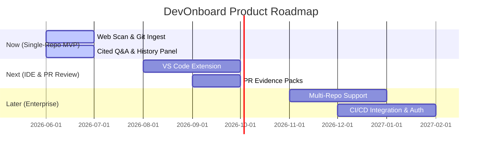

# Product Roadmap

*Purpose: The Product Roadmap is a strategic communication tool. It translates the high-level product vision into an actionable, sequenced plan. It aligns stakeholders (executives, marketing, sales) and the development team on what is being built, why it's being built, and when roughly to expect it.*

---

## Vision (Tầm nhìn)
**Biến lịch sử phát triển phần mềm thành tri thức học máy có trích dẫn, giúp quá trình onboarding codebase diễn ra tức thì và mọi hoạt động refactor code trở nên an toàn tuyệt đối cho mọi đội ngũ kỹ sư trên thế giới.**

---

## Strategy (Chiến lược)
*   **Wedge tiếp cận (Ưu thế cạnh tranh):** Tập trung vào kiến trúc **local-first** và **xác thực nguồn gốc chứng cứ (Provenance)**. Thay vì cung cấp một chatbot viết code thông thường, DevOnboard tập trung giải quyết bài toán "Tại sao code lại như vậy" bằng cách trích dẫn chính xác các commit/PR lịch sử. Điều này giúp loại bỏ rào cản lớn nhất về bảo mật IP mã nguồn của doanh nghiệp.
*   **Bản địa hóa thị trường:** Đánh mạnh vào phân khúc doanh nghiệp công nghệ tại Việt Nam đang gặp khủng hoảng về luân chuyển nhân sự cấp cao (Senior turnover) và khoảng cách năng lực của nhân sự mới ra trường (Junior skills gap). Định vị sản phẩm như một giải pháp **"Bảo hiểm tri thức"** cho doanh nghiệp Việt.

---

## Capabilities (Themes - Các nhóm tính năng)

### Theme 1: Single-Repo Cited Memory (Now)
*   *Mô tả:* Xây dựng công cụ quét local, liên kết cấu trúc code hiện tại với lịch sử Git/PR thành biểu đồ tri thức cục bộ.
*   *Tính năng chính:* Web-triggered Scanner, Web-triggered History Ingest, đồ thị Provenance dạng JSON, Hỏi đáp có trích dẫn (Cited Q&A), Bảng Lịch sử/Lý do thiết kế (History/Why Panel) và Báo cáo đối chiếu (Benchmark Dashboard).

### Theme 2: IDE Integration & PR Review Workflows (Next)
*   *Mô tả:* Tích hợp sâu vào quy trình làm việc hàng ngày của kỹ sư để tăng tương tác và mang lại giá trị tức thì.
*   *Tính năng chính:* Tích hợp VS Code extension (tự động gợi ý bối cảnh của file đang mở - Zero-Click), tự động phân tích rủi ro Refactor (Refactor-Risk Checker), đóng gói chứng cứ PR (PR Review Evidence Packs).

### Theme 3: Multi-Repo Team Platform (Later)
*   *Mô tả:* Mở rộng quy mô từ dự án đơn lẻ chạy local sang nền tảng tri thức dùng chung cho toàn doanh nghiệp.
*   *Tính năng chính:* Quản lý đa repository (Multi-repo graph), tích hợp sâu vào hệ thống CI/CD (GitHub Actions/GitLab CI) để tự động phân tích bối cảnh PR, cơ chế cho phép kỹ sư ghi chú/đính chính tri thức thủ công.

---

## Success Metrics (Chỉ số đo lường thành công)
*   **Time-to-Value (TTV) đầu tiên:** Kỹ sư mới nhận được giá trị giải thích codebase có ích đầu tiên trong vòng **60 giây** sau khi cài đặt.
*   **Thời gian xác minh (Verification Speed):** Người dùng có thể đối chiếu và xác minh tính đúng đắn của một khẳng định từ AI dựa trên link commit/PR thô trong vòng dưới **60 giây**.
*   **Tần suất tương tác (Engagement):** 80% kỹ sư sử dụng bảng điều khiển hoặc hỏi đáp ít nhất 3 lần/ngày khi làm việc trên các module lạ.
*   **Mức độ an toàn IP (Security):** 100% doanh nghiệp thử nghiệm xác nhận không có bất kỳ dòng code nguồn nào bị rò rỉ hoặc gửi lên LLM công cộng khi dùng chế độ local-first.

---

## Time Horizon (Lộ trình thời gian)

*   **NOW (Quý hiện tại):** Tập trung hoàn thiện bản thử nghiệm local trên repo mẫu `nextlevelbuilder/goclaw`. Đạt chỉ tiêu chạy mượt mà trên giao diện Next.js local với backend FastAPI.
*   **NEXT (3-6 tháng tới):** Tập trung vào trải nghiệm lập trình hàng ngày của nhà phát triển bằng VS Code extension và quy trình review Pull Request trên GitHub.
*   **LATER (6-12 tháng tới):** Tập trung vào khách hàng Enterprise cần quản lý bảo mật, phân quyền và liên kết nhiều repository phức tạp của công ty.
