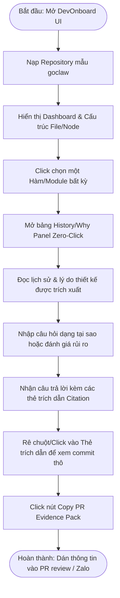

# Prototype Plan

*Purpose: The Prototype Plan directs the design phase. A prototype is a simulation of the final product used to test concepts with users and align stakeholders before writing expensive production code. This document outlines exactly what that simulation needs to achieve.*

---

## 1. User Flow Diagram (Sơ đồ luồng người dùng)

Dưới đây là luồng trải nghiệm chính (Happy Path) mà kỹ sư Junior (Đức) hoặc Tech Lead (Hùng) sẽ thực hiện trong bản thử nghiệm DevOnboard để xác minh giả định cốt lõi:

---

## 2. Frontend (FE) Prototype Focus (Trọng tâm giao diện thử nghiệm)

### Cấp độ trung thực (Level of Fidelity)
*   **Fidelity:** Trung thực cao (High-Fidelity) dạng giao diện Web Dashboard tương tác được.
*   **Aesthetic Style (Mỹ thuật):** Sử dụng thiết kế Sleek Dark Mode (chủ đạo màu xám tối và xanh neon), bố cục phân chia rõ ràng (split-pane) tạo cảm giác chuyên nghiệp cho lập trình viên. Font chữ đồng bộ dòng Code (Roboto Mono/Outfit) thay vì font mặc định của trình duyệt.

### Các tương tác chính (Key Interactions)
1.  **Sơ đồ cấu trúc động (Interactive File/Code Graph):** Cho phép rê chuột phóng to/thu nhỏ, click vào các node (file/function) để kích hoạt sự kiện.
2.  **Bảng bối cảnh Zero-Click (History/Why Panel):** Xuất hiện mượt mà từ cạnh phải màn hình ngay khi người dùng chọn node code, tự động tải dữ liệu bối cảnh lịch sử liên quan mà không có độ trễ UI.
3.  **Thẻ trích dẫn Hover-Popup (Citation Cards):** Khi rê chuột vào thẻ trích dẫn (ví dụ: `[commit:457c95]`), giao diện hiển thị một popup nhỏ chứa nội dung commit message thô và tác giả để người dùng đối chiếu nhanh mà không cần rời màn hình.
4.  **Hộp thoại sao chép gói chứng cứ (Export Modal):** Một click sao chép toàn bộ gói chứng cứ được định dạng Markdown chuẩn để lập trình viên sẵn sàng paste vào GitHub PR comment hoặc Zalo.

### Cơ chế giả lập Backend (Faked Backend)
*   **Dữ liệu tĩnh (Mock Data):** Để kiểm thử nhanh và đảm bảo tính ổn định trong quá trình đánh giá, hệ thống sẽ sử dụng file đồ thị tri thức mẫu đã được tính toán trước (`knowledge-graph.json`) cho repo `nextlevelbuilder/goclaw`.
*   **Hỏi đáp cố định:** Các câu hỏi trong bộ benchmark (5 câu hỏi cốt lõi) sẽ được trả về kết quả giả lập từ các kịch bản chuẩn bị sẵn (hoặc kết nối trực tiếp API LLM với prompt được tối ưu hóa sẵn) để đảm bảo tốc độ phản hồi dưới 2 giây và độ chính xác trích dẫn tuyệt đối.
